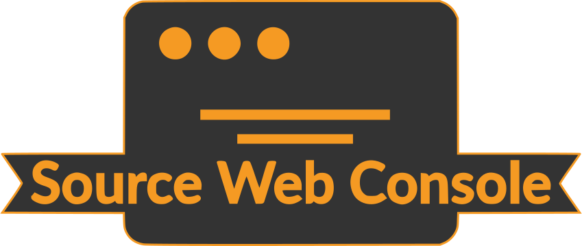
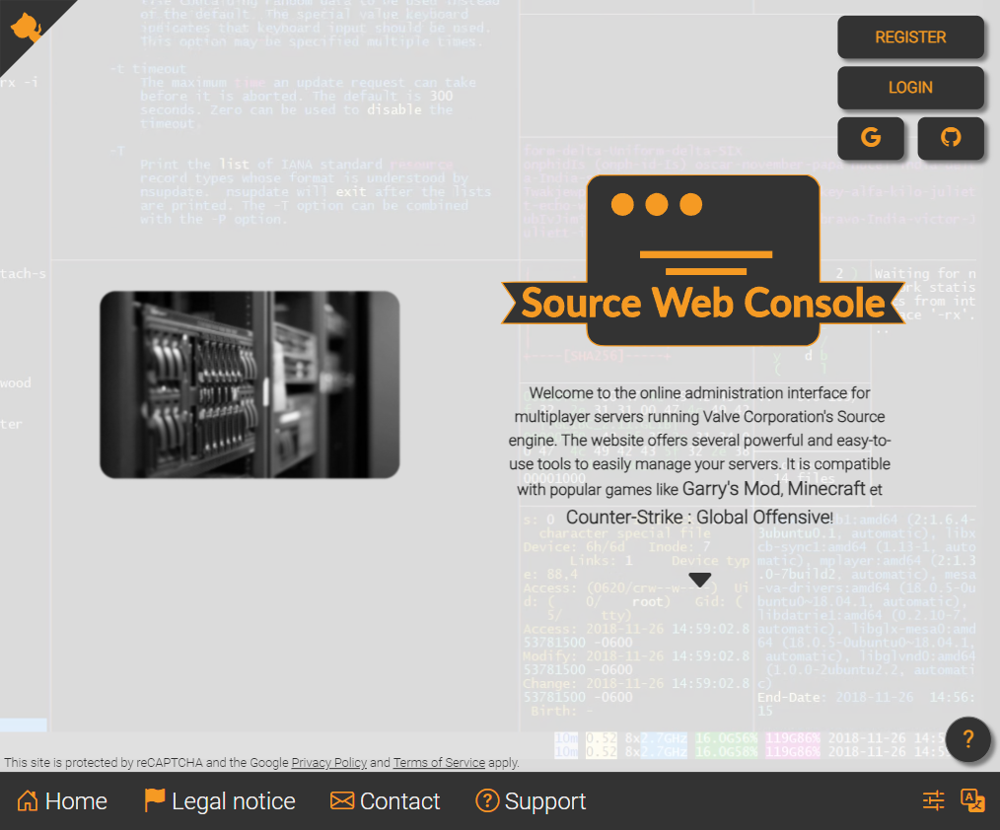

# 🕹️ Source Web Console

## In French

> [!IMPORTANT]
> Depuis mars 2026, le code du projet est désormais hébergé sur mon instance GitLab personnalisée, accessible à [cette adresse](https://git.florian-dev.fr/floriantrayon/Source-Web-Console). Le dépôt GitHub est un miroir du dépôt GitLab, **mis à jour automatiquement**.
>
> **Les contributions publiques restent sur GitHub et sont les bienvenues** ; les pull requests validées y seront ensuite transférées manuellement sur GitLab pour être intégrées. 🙂

C'est un projet réalisé durant mes études afin de permettre de gérer les serveurs dédiés de jeu utilisant le protocole **[Source RCON](https://developer.valvesoftware.com/wiki/Source_RCON_Protocol)** à travers une interface graphique. La réalisation de ce projet est intervenue après celui de mon **[portfolio](https://github.com/FlorianLeChat/Portfolio)**, qui lui aussi a reçu une refonte graphique et technologique.

À la fin de la première version du projet en utilisant seulement des langages et technologies natives d'Internet (branche `no-symfony`), la dernière version reprend le code d'origine tout en basculant sur le *framework* [Symfony](https://symfony.com/) pour profiter d'améliorations techniques, de performances mais aussi de sécurité. De plus, même si le souffre encore d'une dette technologique assez importante par l'absence de *framework* pour gérer la partie interface, le code d'origine a été migrée vers [TypeScript](https://www.typescriptlang.org/) pour une meilleure robustesse.

> [!TIP]
> Voir le fichier [SETUP.md](SETUP.md) pour consulter les instructions d'installation.

> [!NOTE]
> Tout ou partie du code peut contenir des commentaires dans ma langue natale (le français) afin de faciliter le développement. 🌐

> [!CAUTION]
> Ce projet est conçu pour fonctionner dans un environnement de production, mais celui-ci doit être considéré comme une « preuve de concept » pour mes études concernant l'utilisation de technologies Internet natives pour communiquer avec le protocole RCON, si vous comptez utiliser ce genre de sites pour administrer votre serveur, je ne peux que vous conseillez l'excellent [**Pterodactyl**](https://pterodactyl.io/).

## In English

> [!IMPORTANT]
> Since March 2026, the project's code has been hosted on my custom GitLab instance, accessible at [this address](https://git.florian-dev.fr/floriantrayon/Source-Web-Console). The GitHub repository is a mirror of the GitLab repository, **automatically kept up to date**.
>
> **Public contributions remain on GitHub and are welcome**; validated pull requests will then be manually transferred to GitLab to be integrated. 🙂

This is a project made during my studies to manage dedicated game servers using the **[Source RCON](https://developer.valvesoftware.com/wiki/Source_RCON_Protocol)** protocol through a graphical interface. The realization of this project came after that of my **[portfolio](https://github.com/FlorianLeChat/Portfolio)**, which also received a graphic and technological overhaul.

Following the end of the first project version using only native Web languages and technologies (`no-symfony` branch), the latest version reuses the original code while migrating to the [Symfony](https://symfony.com/) framework to enjoy technical, performance and security improvements. Even though it still suffers from a significant technological debt due to the absence of a framework to manage the front-end, the original code has been migrated to [TypeScript](https://www.typescriptlang.org/) for greater robustness.

> [!TIP]
> See the [SETUP.md](SETUP.md) file for setup instructions. 🛠️

> [!NOTE]
> All or part of the code may contain comments in my native language (French) to ease development. 🌐

> [!CAUTION]
> This project is intended to run in a production environment, but it should be considered as a "proof of concept" for my studies concerning the usage of native Web technologies to communicate with RCON protocol. If you intend to use this kind of website to manage your server, I advise you to consider using the excellent [**Pterodactyl**](https://pterodactyl.io/).

